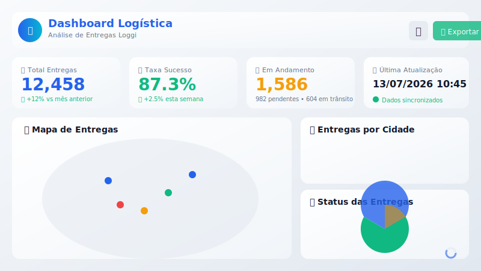

# 🚚 Dashboard Logística Loggi

[](https://python.org)
[](https://dash.plotly.com)
[](LICENSE)
[](https://github.com/charliermarsh/ruff)

> Dashboard enterprise para análise e monitoramento de operações logísticas em tempo real.

## 🎬 Demo Interativa

### Dashboard Principal


### Dark Mode


### Filtros em Tempo Real


## 📋 Índice

- [Visão Geral](#-visão-geral)
- [Galeria de Features](#-galeria-de-features)
- [Funcionalidades](#-funcionalidades)
- [Tecnologias](#-tecnologias)
- [Instalação Rápida](#-instalação-rápida)
- [Uso](#-uso)
- [Estrutura do Projeto](#-estrutura-do-projeto)
- [Deploy](#-deploy)
- [Testes](#-testes)
- [Contribuindo](#-contribuindo)
- [Licença](#-licença)

---

## 🎯 Visão Geral

O **Dashboard Logística Loggi** é uma aplicação web profissional para visualização e análise de dados de entregas. Desenvolvido com as melhores práticas enterprise, oferece:

- **Interatividade completa**: Filtros dinâmicos por região, hub e status
- **Performance otimizada**: Cache inteligente e processamento eficiente
- **Design moderno**: UI responsiva com temas claro/escuro
- **Pronto para produção**: Docker, CI/CD e monitoramento

**Caso de Uso**: Monitorar operações de entrega, identificar gargalos, analisar performance de hubs e gerar insights para tomada de decisão.

---

## 🎨 Galeria de Features

### 📊 KPIs em Tempo Real

| Métrica | Descrição |
|---------|-----------|
| 📦 **Total Entregas** | Volume total com indicador de crescimento |
| ✅ **Taxa de Sucesso** | Percentual de entregas concluídas com sucesso |
| ⏳ **Em Andamento** | Pendentes + Em trânsito com detalhamento |
| 🕐 **Última Atualização** | Status de sincronização dos dados |

### 🗺️ Mapa Interativo

- Visualização geográfica com markers por status
- Cores diferenciadas: ✅ verde (entregue), 🚚 azul (trânsito), ⏳ laranja (pendente), ❌ vermelho (cancelado)
- Hover tooltips com detalhes da entrega
- Zoom e pan para exploração

### 📈 Gráficos Dinâmicos

1. **Barras por Cidade** - Top 15 cidades com gradiente de cores
2. **Pizza de Status** - Distribuição percentual com donut chart
3. **Capacidade de Hubs** - Utilização vs capacidade com linha de referência

### 🎛️ Filtros Avançados

- **Multi-seleção** em tempo real
- **Checklists com switch** para ativação rápida
- **Atualização automática** sem necessidade de botão "Aplicar"
- **Botão Limpar** para resetar todos os filtros

### 🌓 Dark Mode

- Alternância suave com animação
- Paleta de cores otimizada para modo escuro
- Persistência de preferência do usuário

---

## ✨ Funcionalidades

### Principais

| Funcionalidade | Descrição |
|---------------|-----------|
| 🗺️ **Mapa Interativo** | Visualização geográfica de entregas com Plotly + Mapbox |
| 📊 **KPIs em Tempo Real** | Cards com métricas principais (total, taxa de sucesso, pendentes) |
| 📈 **Gráficos Dinâmicos** | Barras, pizza e capacidade por hub |
| 🎛️ **Filtros Avançados** | Por estado, cidade, hub e status da entrega |
| 🌓 **Dark Mode** | Alternância de tema com persistência |
| 📥 **Exportação de Dados** | Download de CSV/Excel dos dados filtrados |

### Diferenciais Enterprise

- ✅ **Type hints** completos em todo código
- ✅ **Logging estruturado** com structlog (JSON em produção)
- ✅ **Validação de dados** com Pydantic
- ✅ **Cache multi-backend** (diskcache, Redis)
- ✅ **Configuração centralizada** com variáveis de ambiente
- ✅ **Testes automatizados** com pytest
- ✅ **CI/CD** com GitHub Actions

---

## 🛠 Tecnologias

| Camada | Tecnologia |
|--------|-----------|
| **Linguagem** | Python 3.11+ |
| **Framework Web** | [Dash](https://dash.plotly.com/) 2.18+ |
| **UI Components** | [Dash Bootstrap Components](https://dash-bootstrap-components.opensource.faculty.ai/) |
| **Visualização** | [Plotly](https://plotly.com/python/) |
| **Dados** | Pandas, NumPy |
| **Validação** | Pydantic 2.8+ |
| **Cache** | diskcache, Redis (opcional) |
| **Logging** | structlog |
| **Contêinerização** | Docker, Docker Compose |
| **CI/CD** | GitHub Actions |

---

## 🏗️ Arquitetura

### Fluxo de Dados


### Diagrama de Componentes

```
┌─────────────────────────────────────────────────────────────┐
│                     Dashboard Loggi                         │
├─────────────────────────────────────────────────────────────┤
│  ┌─────────────┐  ┌──────────────┐  ┌─────────────────┐   │
│  │   Header    │  │  KPI Cards   │  │  theme toggle   │   │
│  │  (Logo+Título│  │ 4 métricas  │  │  + export CSV   │   │
│  └─────────────┘  └──────────────┘  └─────────────────┘   │
│  ┌─────────────┐  ┌──────────────────────────────────┐    │
│  │   Sidebar   │  │       Mapa Interativo            │    │
│  │  - Estados  │  │   (Scatter Geo + markers)        │    │
│  │  - Cidades  │  │                                  │    │
│  │  - Hubs     │  └──────────────────────────────────┘    │
│  │  - Status   │  ┌──────────────┐  ┌──────────────┐     │
│  │             │  │ Gráfico Barras│  │ Gráfico Pizza│     │
│  │ [Aplicar]   │  │  (por cidade)│  │  (status)    │     │
│  │ [Limpar]    │  └──────────────┘  └──────────────┘     │
│  └─────────────┘  ┌──────────────────────────────────┐    │
│                   │   Capacidade por Hub             │    │
│                   │   (barras + linha de referência) │    │
│                   └──────────────────────────────────┘    │
└─────────────────────────────────────────────────────────────┘
                            │
                            ▼
        ┌───────────────────────────────────────┐
        │         Data Layer                    │
        │  ┌─────────┐  ┌──────────┐  ┌──────┐ │
        │  │ Loader  │→│Processor │→│ Cache│ │
        │  └─────────┘  └──────────┘  └──────┘ │
        └───────────────────────────────────────┘
```

---

## 🚀 Instalação Rápida

### Opção 1: Desenvolvimento Local

```bash
# Clonar repositório
git clone https://github.com/Lelolima/dashboard-logistica-loggi.git
cd dashboard-logistica-loggi

# Criar ambiente virtual
python -m venv venv
venv\Scripts\activate  # Windows
# ou: source venv/bin/activate  # Linux/Mac

# Instalar dependências
pip install -r requirements.txt

# Copiar variáveis de ambiente
cp .env.example .env

# Executar dashboard
python -m src.app
```

Acesse: `http://localhost:8050`

### Opção 2: Docker (Recomendado para Produção)

```bash
# Build e run com Docker Compose
docker-compose up --build
```

Acesse: `http://localhost:8050`

---

## 📖 Uso

### Com Data_SOURCE Local (padrão)

O dashboard já inclui dados de exemplo gerados automaticamente.

### Conectando a API Externa

Edite `.env`:

```ini
DATA_SOURCE=api
DATA_API_URL=https://sua-api.com/entregas
```

### Personalizando Mapas

Para mapas avançados com Mapbox:

```ini
MAPBOX_TOKEN=pk.eyJ...
```

Obtenha seu token em: https://account.mapbox.com/

---

## 📁 Estrutura do Projeto

```
dashboard-logistica-loggi/
├── src/
│   ├── __init__.py           # Package init + logging
│   ├── app.py                # App Dash principal
│   ├── config.py             # Configurações com Pydantic
│   ├── styles.py             # Design system e temas
│   ├── callbacks.py          # Callbacks do Dash
│   ├── visualizations.py     # Gráficos Plotly
│   ├── data/
│   │   ├── __init__.py
│   │   ├── loader.py         # Carregamento de dados
│   │   └── processor.py      # Processamento e métricas
│   ├── utils/
│   │   ├── __init__.py
│   │   ├── logger.py         # Logging estruturado
│   │   ├── cache_manager.py  # Gerenciador de cache
│   │   └── data_validator.py # Validação Pydantic
│   └── components/
│       ├── __init__.py
│       ├── header.py         # Componente Header
│       ├── sidebar.py        # Componente Sidebar
│       ├── metrics_cards.py  # Cards de KPI
│       └── footer.py         # Componente Footer
├── assets/
│   ├── style.css             # CSS customizado
│   └── logo.svg              # Logo animado
├── tests/
│   ├── test_data_loader.py
│   ├── test_visualizations.py
│   └── test_processor.py
├── docs/
│   ├── ARQUITETURA.md        # Documentação técnica
│   └── assets/               # Imagens da docs
├── .github/workflows/
│   └── ci.yml                # CI/CD pipeline
├── .env.example              # Template de variáveis
├── .gitignore
├── docker-compose.yml
├── Dockerfile
├── pyproject.toml
├── requirements.txt
└── README.md
```

---

## 🌐 Deploy

### Render

```bash
# Conectar repositório no Render
# Definir variáveis de ambiente
# Build command: pip install -r requirements.txt
# Start command: gunicorn -b 0.0.0.0:$PORT src.app:server
```

### AWS ECS

```bash
# Build da imagem
docker build -t dashboard-logistica .

# Push para ECR
docker push <account>.dkr.ecr.region.amazonaws.com/dashboard:latest

# Deploy no ECS
```

### Azure App Service

```bash
# Configurar Docker Registry
# Deploy via Azure CLI
az webapp create --resource-group <rg> --plan <plan> --name <app> \
  --deployment-container-image-name dashboard-logistica:latest
```

---

## 🧪 Testes

```bash
# Rodar todos os testes
pytest

# Com coverage
pytest --cov=src --cov-report=html

# Coverage em HTML
open htmlcov/index.html
```

### Lint e Formatação

```bash
# Lint com Ruff
ruff check src/

# Formatar com Black
black src/

# Verificar tipos (opcional)
mypy src/
```

---

## 🤝 Contribuindo

1. Fork o projeto
2. Crie uma branch para sua feature (`git checkout -b feature/AmazingFeature`)
3. Commit suas mudanças (`git commit -m 'Add: AmazingFeature'`)
4. Push para a branch (`git push origin feature/AmazingFeature`)
5. Abra um Pull Request

### Padrões de Código

- **Type hints** em todas as funções
- **Docstrings** no formato Google
- **Testes** para novas funcionalidades
- **Commits** no padrão Conventional Commits

---

## 📄 Licença

Este projeto está sob a licença MIT. Veja [LICENSE](LICENSE) para detalhes.

---

## 👨‍💻 Autor

**Wellington**
- GitHub: [@Lelolima](https://github.com/Lelolima)

## 🙏 Agradecimentos

- Dados de exemplo baseados em operações reais da Loggi
- Inspirado por dashboards enterprise de logística

---

<div align="center">

**Dashboard Logística Loggi** v2.0.0

Feito com ❤️ por Wellington

[⬆️ Voltar ao topo](#-dashboard-logística-loggi)

</div>

---

## 📊 Status do Projeto

| Status | Descrição |
|--------|-----------|
| 🟢 **Versão** | 2.0.0 BI Enterprise |
| 🟢 **Python** | 3.11+ compatível |
| 🟢 **Dash** | 2.18+ com callbacks em tempo real |
| 🟢 **Plotly** | 5.22+ com gráficos enterprise |
| 🟡 **Documentação** | Em constante atualização |
| 🟢 **Testes** | pytest + coverage |
| 🟢 **Docker** | Imagem pronta para produção |

## 🚀 Quick Start

### 30 segundos com Docker

```bash
docker-compose up --build
# Acesse: http://localhost:8050
```

### 2 minutos desenvolvimento local

```bash
git clone https://github.com/Lelolima/dashboard-logistica-loggi.git
cd dashboard-logistica-loggi
python -m venv venv
venv\Scripts\activate  # Windows
pip install -r requirements.txt
python main.py
```

### Features Demonstradas

| Feature | Status | Descrição |
|---------|--------|-----------|
| 🗺️ Mapa Interativo | ✅ Pronto | Plotly Scatter Geo com markers animados |
| 📊 KPIs Tempo Real | ✅ Pronto | Atualização automática sem refresh |
| 🎛️ Filtros | ✅ Pronto | Multi-select com checklist switch |
| 🌓 Dark Mode | ✅ Pronto | Toggle com ícone dinâmico |
| 📥 Export CSV | ✅ Pronto | Download dos dados filtrados |
| 📈 Gráficos | ✅ Pronto | Barras, pizza, linha, capacidade |
| 🏢 Hubs | ✅ Pronto | Utilização vs capacidade |
| 📑 Relatório Executivo | ✅ Pronto | Insights automatizados |